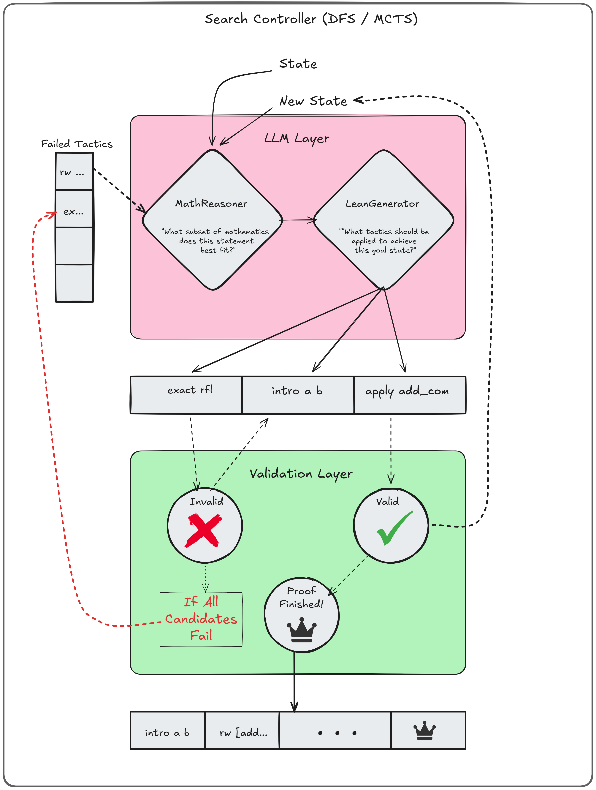
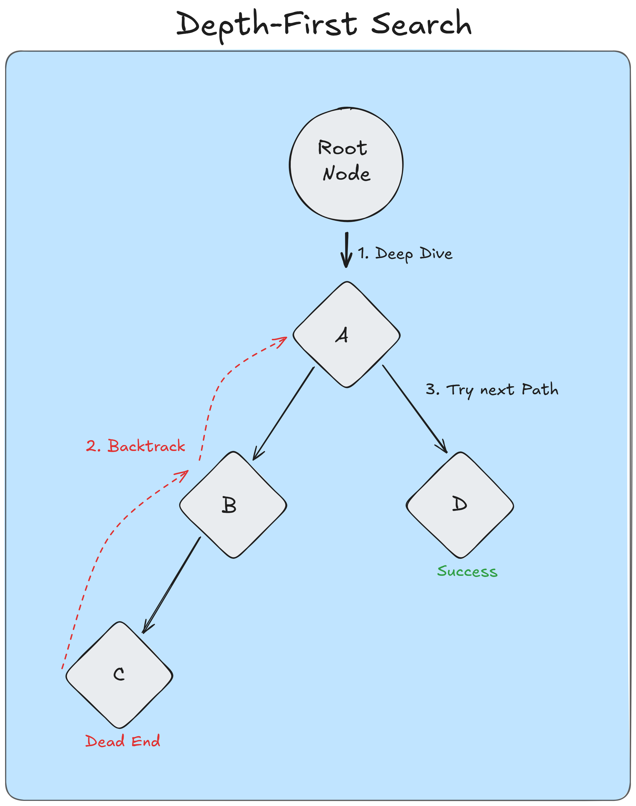
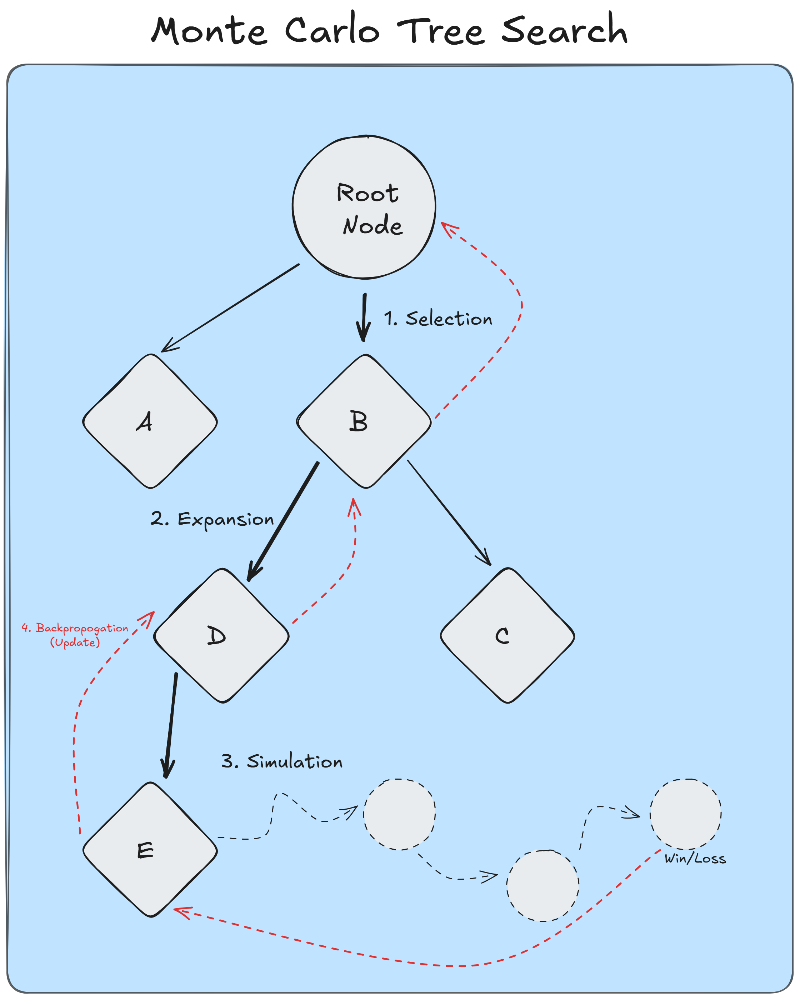
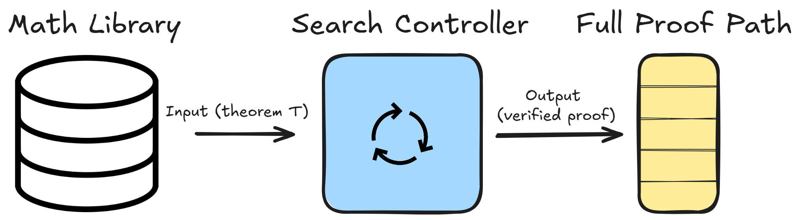

# Hybrid Neuro-Symbolic Theorem Prover

## 📖 Project Overview

This project implements a **Hybrid Neuro-Symbolic System** designed to bridge the gap between the intuitive, creative reasoning of **Large Language Models (LLMs)** and the rigorous, logical precision of symbolic proof assistants like **Lean 4**.

While modern LLMs excel at intuition, they often "hallucinate" or fail to adhere to strict formal syntax. Conversely, proof assistants are perfectly accurate but lack the creativity to guide a proof search effectively. Our system combines these strengths by using an LLM to generate high-level strategies and a symbolic engine to validate every step.

### Key Contributions
* **Strategy Generation:** The LLM does not just output raw proof text; it generates a strategy and decomposes it into sub-goals.
* **Adaptive Reasoning:** The system utilizes a feedback loop where the LLM revises its approach based on success/failure signals from the Lean compiler.
* **Search Guidance:** Implements search algorithms (DFS/MCTS) guided by neuro-symbolic heuristics.

---

## 👥 The Team

* **Alex Eduardo Sanchez**
* **Brandon Rodriguez**
* **Parker Esco**
* **Andres Acosta**
* **Gianni Martinez**

---

## 🏗️ Architecture

The system operates on a **Generator-Validator** loop. The architecture is split into a **Search Controller** (Python) and a **Validation Layer** (Lean 4).

### 1. The Neuro-Symbolic Agents
The **LLM Layer** is composed of two specialized agents:
1.  **MathReasoner:** Analyzes the current state and asks questions such as *"What subset of mathematics does this statement best fit?"*, *"What tactics have failed in the past"*, and *"What are the most common causal relationships?"* to generate a high-level strategy.
2.  **LeanGenerator:** Translates the strategy into concrete Lean tactics (e.g., `intro a b`, `apply add_comm`).

### 2. Validation & Feedback
Every candidate tactic is sent to the **Validation Layer**:
* **✅ VALID:** The proof state advances, and the new state is returned to the Search Controller.
* **❌ INVALID:** The tactic is rejected, and the failure is logged to guide the next expansion.
* **👑 PROOF FINISHED:** The goal is solved.

### 3. Search Strategies
The **Search Controller** manages the exploration of the proof tree using:
* **DFS (Depth-First Search):** For rapid exploration of promising branches.
* **MCTS (Monte Carlo Tree Search):** *(Future Work)* For balancing exploration and exploitation in complex proof spaces.

---

## ⚙️ How It Works

1.  **Input:** The system accepts a theorem $T$ in natural language or Lean syntax.
2.  **Conversion:** A pipeline converts natural language requests into formal statements.
3.  **Expansion:** The LLM proposes a list of candidate tactics.
4.  **Verification:** Lean compiles the tactics. Valid steps expand the tree; invalid steps prune the branch.
5.  **Output:** A fully verified proof path.

---

## 💻 Installation & Setup
